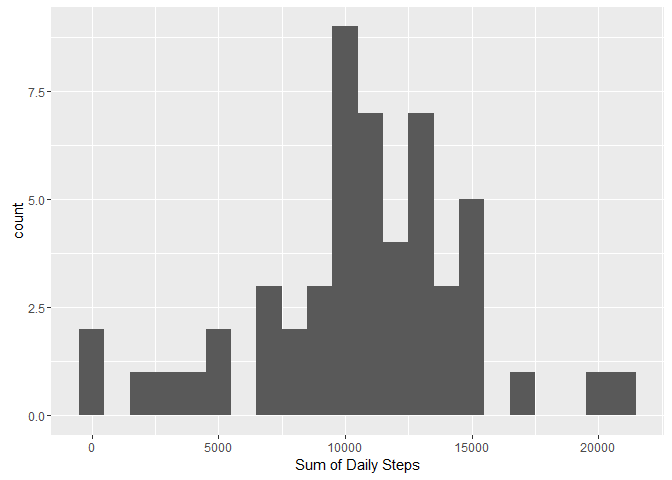
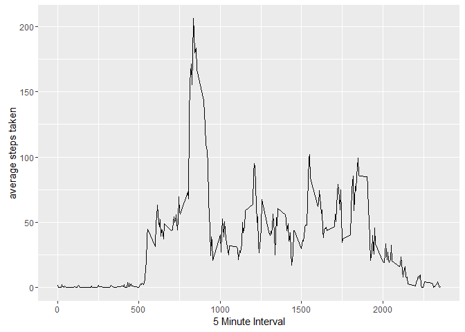
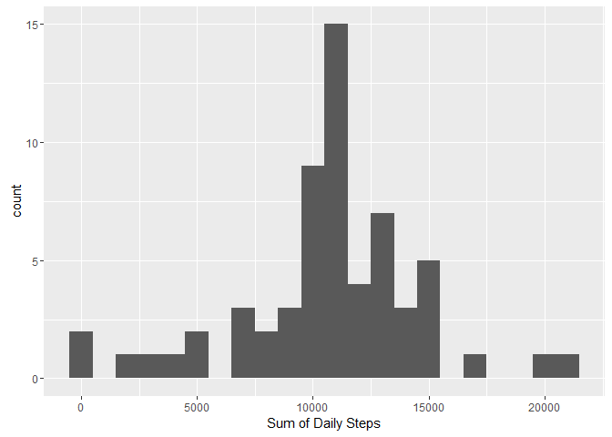
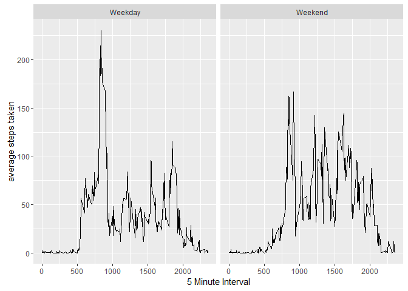

# Reproducible Research Project 1
Chris Walsh  
August 27, 2016  


Activity Monitoring Analysis
============================

This document will analyze the provided activty tracker data and answer the four
questions provided in the assignment.


###Load and pre-process the data


```r
unzip(zipfile = "activity.zip")
actdata <- read.csv("activity.csv")
require(lubridate)
actdata$date <- ymd(as.character(actdata$date))
```


###What is mean total number of steps taken per day?


```r
require(dplyr)
require(ggplot2)
actdatacc <- filter(actdata, complete.cases(actdata))
dailysum <- actdatacc %>% group_by(date) %>% summarize("sum" = sum(steps))
ggplot(dailysum, aes(x=sum)) + geom_histogram(binwidth = 1000) + 
        xlab("Sum of Daily Steps")
```

<!-- -->


The mean number of steps in a day can be found as:

```r
mean(dailysum$sum)
```

```
## [1] 10766.19
```


The median number of steps in a day can be found as:

```r
median(dailysum$sum)
```

```
## [1] 10765
```


###What is the average daily activity pattern?


```r
dailypattern <- actdatacc %>% group_by(interval) %>% summarize("avg" = mean(steps))
ggplot(dailypattern, aes(x=interval, y=avg)) + geom_line() + 
        xlab("5 Minute Interval") + ylab("average steps taken")
```

<!-- -->

On average across the sample, the following interval contains the highest number of steps:


```r
filter(dailypattern, avg == max(avg))
```

```
## Source: local data frame [1 x 2]
## 
##   interval      avg
##      (int)    (dbl)
## 1      835 206.1698
```


###Imputing missing values

A number of intervals are currently missing step values (displayed as NA).


```r
table(is.na(actdata$steps))
```

```
## 
## FALSE  TRUE 
## 15264  2304
```

These data elements can be imputed by replacing NAs with the sample average for the given interval.


```r
imp <- function (steps, interval) {
        if (!is.na(steps))
                imputed <- steps
        else
                imputed <- dailypattern[dailypattern$interval == interval,"avg"]
        return(imputed)
}

impdata <- actdata
impdata$steps <- unlist(mapply(imp, impdata$steps, impdata$interval))
```

With these missing elements imputed, we can revisit the histogram of daily steps as well as the mean and median steps per day.

The mean number of steps in a day when including these imputed values can be found as:

```r
impdailysum <- impdata %>% group_by(date) %>% summarize("sum" = sum(steps))
mean(impdailysum$sum)
```

```
## [1] 10766.19
```


The median number of steps in a day when including these imputed values can be found as:

```r
median(impdailysum$sum)
```

```
## [1] 10766.19
```

These mean and median values do not differ significantly from the previously calucated values. This is to be expected. Our original sample was missing step data for a number of entire days.

Number of days in original sample:


```r
length(unique(actdata$date))
```

```
## [1] 61
```

Number of days containing step data in original sample:


```r
length(unique(actdatacc$date))
```

```
## [1] 53
```

When data is imputed for these additional 8 days based on the average interval profile, we would not expect that average to substantially change. This change is visible in the histogram, where we can see an increase in the count of days that reflect this overall average.


```r
ggplot(impdailysum, aes(x=sum)) + geom_histogram(binwidth = 1000) + 
        xlab("Sum of Daily Steps")
```

<!-- -->


###Are there differences in activity patterns between weekdays and weekends?

In order to address differences in activity patterns we must first identify the data by the day of the week:


```r
wknd <- function (date) {
        if (wday(date) %in% c(2:6))
                day <- "Weekday"
        else
                day <- "Weekend"
        return(day)
}

impdata$day <- sapply(impdata$date, wknd)
```

Once this has been identified in the data, we can use it to segment the previous panel plot:


```r
dailypattern <- impdata %>% group_by(interval, day) %>% summarize("avg" = mean(steps))
ggplot(dailypattern, aes(x=interval, y=avg)) + geom_line() + 
        xlab("5 Minute Interval") + ylab("average steps taken") + facet_wrap(~day)
```

<!-- -->

The plot above indicates that weekdays do tend to see higher peak step values than weekend on average.
